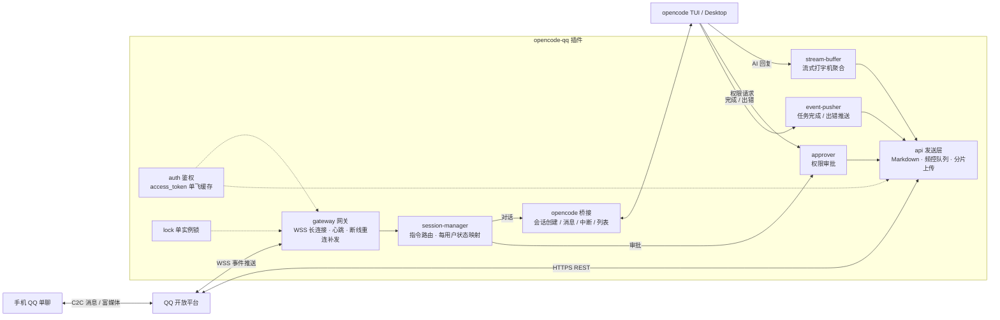

<div align="center">


# OpenCode-QQ

适用于 [OpenCode](https://opencode.ai)（TUI / Desktop）的 QQ 官方机器人连接插件

在 QQ 单聊里与 AI 对话，远程驱动 opencode 干活：对话、审批、切模型、收发文件，一个都不落。

[](https://www.npmjs.com/package/opencode-qq)
[](./LICENSE)
[](https://www.typescriptlang.org/)
[](https://bun.sh/)
[]()

**TypeScript** · **Bun** · **Vitest** · **WebSocket**

</div>

## 功能特性

- **QQ 单聊直连 opencode**：消息直达 opencode 会话，AI 回复发回 QQ；每个 QQ 用户一个长期会话，重启后延续
- **Markdown 回复**：默认 Markdown 渲染，可配置降级纯文本
- **流式打字机输出**：长回复边生成边更新，打字机效果呈现
- **图片 / 文件双向收发**：发的图片转多模态让 AI 看图回答；文件自动落盘到项目 `.qq-files/`；AI 也能通过 `qq_send_file` 工具把本地文件发给你
- **QQ 远程审批**：opencode 请求权限（执行命令、写文件）时，QQ 里点【同意】/【拒绝】按钮即可代答，无需回到电脑前
- **模型 / 思考档位 / 工作区 / 会话切换**：`/model` `/thinking` `/workdir` `/session` 随时切换，每用户独立记忆
- **按钮与菜单**：ack 挂【中断】、回复挂【新会话】【状态】；启动时自动同步底部菜单面板（帮助 / 新会话 / 模型▼ / 更多▼）
- **任务推送**：会话完成或出错时主动推送，断线期间的事件重连后补发
- **单实例锁**：多项目窗口只启用一个网关，杜绝重复回复；持有者崩溃后待命实例自动接管

## 部署方式

### 前置条件

1. 在 [QQ 开放平台](https://q.qq.com/) 注册账号（个人或企业主体均可），创建机器人，拿到 **AppID** 与 **AppSecret**
2. 用你的 QQ 号**添加机器人为好友**（快速创建通道的机器人仅支持与管理员单聊，天然白名单）

### 安装

在项目的 `opencode.json` 中加入一行：

```json
{
  "$schema": "https://opencode.ai/config.json",
  "plugin": ["opencode-qq"]
}
```

重启 opencode 后插件自动生效；缺少凭据时插件静默禁用并写日志，不影响 opencode 正常启动。

### 配置

凭据有两种提供方式，环境变量优先于配置文件。

**方式一：扫码绑定（推荐）**

```bash
npx opencode-qq-setup
```

按提示用手机 QQ 扫码授权后，凭据自动写入 `~/.config/opencode/opencode-qq.json`。

**方式二：手写配置文件**

创建 `~/.config/opencode/opencode-qq.json`：

```json
{
  "appId": "你的AppID",
  "appSecret": "你的AppSecret",
  "sandbox": false,
  "allowlist": [],
  "model": "anthropic/claude-sonnet-4-5",
  "markdownReply": true,
  "streaming": true,
  "keyboard": true,
  "events": { "toolProgress": false }
}
```

| 字段 | 默认 | 说明 |
|------|------|------|
| `appId` / `appSecret` | 必填 | 开放平台机器人凭据 |
| `sandbox` | `false` | 默认正式环境；需沙箱调试时改 `true` 并在管理端配置沙箱单聊账号 |
| `allowlist` | `[]` | openid 白名单，空数组 = 不限制 |
| `model` | 无 | 覆盖模型，格式 `providerID/modelID`；不填则用 opencode 全局默认模型 |
| `markdownReply` | `true` | AI 回复是否用 Markdown 发送 |
| `streaming` | `true` | 是否启用流式打字机输出 |
| `keyboard` | `true` | 是否启用按钮与菜单互动 |
| `events.toolProgress` | `false` | 是否推送工具执行进度（每 60 秒至多一条） |

**方式三：环境变量**

不想落盘 secret 时：

```bash
export QQ_BOT_APPID=你的AppID
export QQ_BOT_APPSECRET=你的AppSecret
```

> 安全提示：`appSecret` 等同于机器人密码，切勿提交到仓库或分享；建议优先使用环境变量或扫码绑定。

### 使用

在单聊中发送任意文本即可开始对话，也可以直接发图片、文件。收到「已收到，处理中…」回执后稍候，AI 回复自动送达。

## 命令

### 指令

| 指令 | 行为 |
|------|------|
| `/new` | 重置当前会话，下次消息开启新对话 |
| `/status` | 查看会话、模型、工作区与待审批状态 |
| `/help` | 输出指令说明 |
| `/model` | 查看模型预设列表；`/model N` 切换 |
| `/thinking high\|low` | 切换思考档位（路由到 reasoning 模型） |
| `/workdir` | 查看工作区列表；`/workdir N` 切换（自动开新会话） |
| `/session` | 查看当前工作区会话；`/session N` 切换绑定 |
| `/interrupt` | 中断当前任务 |
| `/continue` | 继续最近的会话 |
| `/retry` | 重试上一条消息 |

### 按钮与菜单

- 权限请求消息附带【同意 N】【拒绝 N】按钮，点击即代答，结果通过事件被动消息反馈
- 「处理中」回执挂【中断】按钮，长任务随时叫停
- AI 最终回复挂【新会话】【状态】按钮
- 启动时自动同步底部菜单：帮助 / 新会话 / 模型▼ / 更多▼，点击自动填入指令

## 错误码相关

所有模块的诊断日志统一格式，`grep opencode-qq` 可一次捞出完整故障链：

```
[opencode-qq][<scope>:<CODE>] 描述 :: 详情 | 排查: 建议
```

高频错误码速查：

| 错误码 | 含义 | 排查方向 |
|--------|------|----------|
| `AUTH001` | 获取 access_token 失败 | 检查网络与 `api.bot.qq.com` 连通性 |
| `AUTH004` | AppID 无效或机器人状态异常 | 管理端核对 AppID 与机器人状态 |
| `AUTH005` | AppSecret 不正确 | 管理端重新复制 AppSecret |
| `GW001` | 获取网关地址失败 | `/gateway` 可达性与鉴权头 |
| `GW006` | intents 无权限（close 4013/4014） | 管理端开通单聊场景及事件权限 |
| `GW007` | 机器人已下架或封禁 | 检查机器人状态 |
| `GW009` | 心跳超时强制重连 | 网络稳定性 |
| `MSG002` | 消息频控 | 串行队列已限速，持续出现联系平台 |
| `MSG003` | 被动回复额度用尽（每条消息 4 条） | 降级主动消息，客户端打开「允许主动发送」 |
| `STREAM003` | 流式限频 | 自动退避重试 |
| `MENU001` | 菜单同步失败 | 接口限 5 QPM，启动时自动重试 |

## 架构设计



一条消息的完整链路：QQ 消息 → 平台事件推送 → 网关接收 → 指令路由（指令直接处理，对话进桥接）→ opencode 会话生成回复 → 流式聚合 / Markdown 渲染 → 发送层按被动窗口、频控策略送达 QQ。权限请求走审批器，按钮点击经互动回调代答回 opencode。

## 开发相关

仓库即插件源码，使用 Bun 管理：

```bash
bun install      # 安装依赖
bun test         # 运行测试（vitest，170+ 用例）
bun run build    # 构建到 dist/
```

项目结构：

```text
src/
├── index.ts             # 插件入口：装配、opencode 桥接、工具注册
├── qq/
│   ├── gateway.ts       # WSS 网关：identify / resume / 心跳 / 重连分级
│   ├── auth.ts          # access_token 鉴权（单飞、错误分类）
│   ├── api.ts           # QQ REST：发消息 / 上传 / 菜单 / 互动应答
│   └── stream.ts        # stream_messages 流式通道
├── session-manager.ts   # 指令系统与每用户状态
├── commands.ts          # 指令解析
├── relay.ts             # 消息中转与工具进度
├── approver.ts          # 权限审批
├── event-pusher.ts      # 任务完成 / 出错推送
├── stream-buffer.ts     # 流式输出缓冲
├── presets.ts           # 模型 / 工作区预设扫描
├── keyboard.ts          # 按钮构造
├── interactions.ts      # 互动事件处理
├── media.ts → util/media.ts  # 附件识别与下载
├── lock.ts              # 单实例锁
├── config.ts            # 配置加载（BOM 兼容）
├── errors.ts            # 统一错误码
└── constants.ts         # 常量与 intent 定义
tests/                   # vitest 测试
bin/setup.mjs            # 扫码绑定 CLI
```

## 注意事项

- **被动消息窗口**：单聊被动回复窗口为收到消息后 60 分钟，每条消息最多回复 4 条；超窗推送自动尝试主动消息，无权限时记日志并在该用户下次来消息时附带说明
- **主动消息限制**：主动消息受平台频控与额度约束，日常使用请以先发消息触发对话为主

## 致谢

- [opencode](https://opencode.ai) — 开源 AI 编码助手
- [QQ 机器人开放平台](https://q.qq.com/) — 官方机器人能力

## 许可证

[MIT](./LICENSE)
